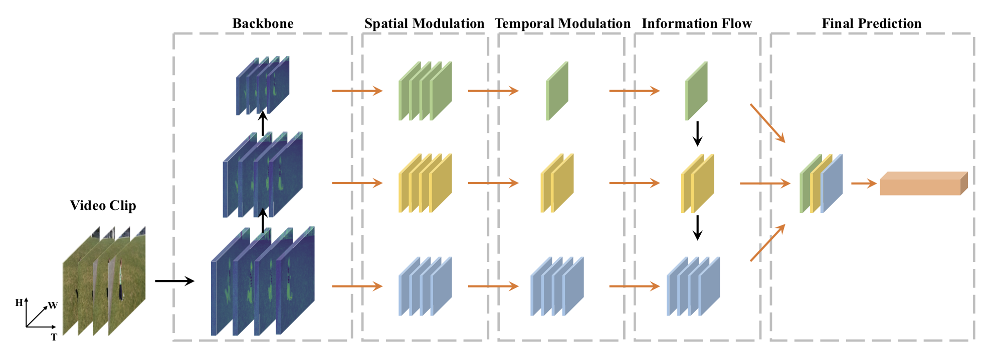

# Temporal Pyramid Network for Action Recognition 


[Paper]
[[Project Page](https://decisionforce.github.io/TPN/)]

## News
- Paper and code are coming soon

## Bibtex
```
@inproceedings{yang2020tpn,
  title={Temporal Pyramid Network for Action Recognition},
  author={Yang, Ceyuan and Xu, Yinghao and Shi, Jianping and Dai, Bo and Zhou, Bolei},
  booktitle={Proceedings of the IEEE Conference on Computer Vision and Pattern Recognition (CVPR)},
  year={2020},
}
```
